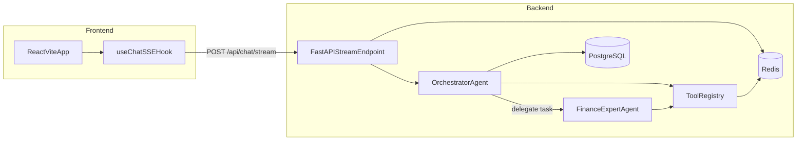

# AI Financial Assistant

Multi-agent financial assistant with grounded web and market retrieval, streaming responses, and persistent chat history.

## Documentation Map

- Product and assignment baseline: [SPEC.md](SPEC.md)
- Backend architecture and API contract: [backend/TECH_SPEC.md](backend/TECH_SPEC.md)
- Frontend architecture and UX contract: [frontend/TECH_SPEC.md](frontend/TECH_SPEC.md)

## Project Functionality

- Multi-agent routing between orchestrator and finance expert.
- Grounded retrieval via Tavily (web/news) and yfinance (market data).
- Inline citations in final responses based on tool output.
- SSE streaming with progressive status updates and token chunks.
- Persistent conversations in PostgreSQL (`ChatSession`, `ChatMessage`).
- Redis-backed ephemeral caching, rate limiting, and request dedupe.
- Anonymous auth/session support with invite-based quota uplift.

## System Architecture



### Agent Responsibilities

- Orchestrator:
  - Loads chat history from PostgreSQL.
  - Selects direct answer vs tool usage vs finance-agent delegation.
  - Runs bounded tool rounds (`max_orchestrator_rounds`).
- Finance expert:
  - Runs in isolated context (`system + specific_task`).
  - Uses allowed tool subset for finance/news retrieval.
  - Returns synthesized grounded result to orchestrator.

### Context Model

- Orchestrator context is bounded by `max_context_messages`.
- History construction uses incremental in-memory append/build behavior to avoid per-round full rebuild.
- Assistant tool calls without matching tool responses are degraded to plain assistant content during history build.

## Runtime Request Flow

1. Client sends user message to `POST /api/chat/stream`.
2. Backend authenticates session and appends user message to PostgreSQL.
3. Orchestrator loop emits `status`, runs tools/delegation as needed, and accumulates citations.
4. Final assistant output is persisted.
5. Backend streams `status`, `token`, then terminal `done` or `error`.

## Technology Stack

- Frontend:
  - React + TypeScript + Vite
  - SSE streaming hook (`useChat`)
- Backend:
  - Python 3.10+, FastAPI, asyncio
  - OpenAI chat completions + function calling
  - SQLModel + Alembic
  - Redis (`redis.asyncio`) + `fastapi-limiter`
- Data and infrastructure:
  - PostgreSQL as system of record
  - Redis as ephemeral layer
  - Docker Compose for local stack
  - Terraform for EC2 + Route53 provisioning

## Storage Design

### PostgreSQL (Durable)

- Source of truth for users, chat sessions, and chat messages.
- Used to reconstruct LLM conversation context for orchestrator runs.

### Redis (Ephemeral)

- Tavily/yfinance cache with TTL.
- Rate limiting for streaming endpoint.
- Short-lived dedupe/idempotency keys for rapid duplicate sends.
- Not used for durable chat message history.

## Local Setup

### 1) Configure Environment

```bash
cp backend/.env.example .env
```

Set required values in `.env`:

- `DATABASE_URL`
- `REDIS_URL`
- `AUTH_JWT_SECRET`
- `OPENAI_API_KEY`
- `TAVILY_API_KEY` (if web search enabled)

### 2) Start the Stack

```bash
docker compose -f docker-compose.yml -f docker-compose.dev.yml up --build
```

or:

```bash
make up
```

Default endpoints:

- Frontend: `http://localhost:5173`
- Backend: `http://localhost:8000`
- RedisInsight: `http://localhost:5540`

### 3) Stop the Stack

```bash
docker compose -f docker-compose.yml -f docker-compose.dev.yml down
```

## Database Migrations

```bash
make db-upgrade
make db-migrate MSG="describe_change"
```

Equivalent backend command:

```bash
alembic upgrade head
```

## Terraform Infrastructure (EC2 + Route53)

Terraform provisions:

- EC2 key pair resource from env-driven public key content.
- Security group with SSH CIDR allowlist.
- EC2 instance (Ubuntu).
- Route53 A record to instance public IP.

### Required Terraform Environment Variables

```bash
export TF_VAR_public_key_content="ssh-ed25519 AAAA... your_email@example.com"
export TF_VAR_ssh_allowed_cidrs='["61.230.122.21/32"]'
```

Optional/common:

```bash
export TF_VAR_aws_region="ap-northeast-1"
export TF_VAR_instance_type="t3.micro"
export TF_VAR_domain_name="chungyulo.xyz"
export TF_VAR_subdomain="marketmind-ai"
```

### Run Terraform

```bash
cd terraform
terraform init
terraform plan
terraform apply -auto-approve
```

Destroy:

```bash
terraform destroy
```

## CI/CD Deployment (GitHub Actions -> EC2)

Workflow: `.github/workflows/deploy-ec2.yml`

- Trigger: push to `main` or manual dispatch.
- SSH deploy using `appleboy/ssh-action`.
- Waits on `cloud-init status --wait` to ensure Terraform user-data bootstrap completed.
- Deploy script:
  - clone/pull in `/opt/marketmind-ai`
  - generate `.env` from GitHub Secrets (recommended: `APP_ENV_B64`)
  - `docker compose -f docker-compose.yml -f docker-compose.prod.yml down`
  - `docker compose -f docker-compose.yml -f docker-compose.prod.yml up -d --build`

Required GitHub repository secrets:

- `EC2_HOST` (plain host/IP, no protocol)
- `EC2_USER` (typically `ubuntu`)
- `EC2_SSH_KEY` (private key matching Terraform public key)
- `APP_ENV_B64` (base64-encoded full root `.env`, recommended)

Fallback per-key secrets if `APP_ENV_B64` is not set:

- `DB_USER`, `DB_PASSWORD`, `DB_NAME`
- `DATABASE_URL`, `REDIS_URL`
- `OPENAI_API_KEY`, `TAVILY_API_KEY`, `AUTH_JWT_SECRET`

## Operations and Troubleshooting

### URL Resolves but App Not Reachable

- Verify containers on instance (`docker ps`).
- Verify security group ports (80/443/22).
- Confirm DNS propagation and target IP.
- Validate services are listening on expected ports.

### GitHub Action SSH Errors

- `ssh.ParsePrivateKey: ssh: no key found`
  - `EC2_SSH_KEY` is malformed or not a private key.
- `dial tcp ... unknown port`
  - `EC2_HOST` includes protocol/scheme; it must be plain host/IP.

### Terraform Prompting for `public_key_content`

Use:

```bash
export TF_VAR_public_key_content="$(cat ~/.ssh/id_ed25519.pub)"
```

### AWS SSO Profile Errors in Terraform

Ensure the selected AWS profile has complete SSO config (`sso_account_id`, `sso_role_name`) and active login.

## Repository Layout

- `backend/`: FastAPI app, AI engine, auth, DB models, migrations.
- `frontend/`: React + TypeScript chat UI.
- `terraform/`: AWS provisioning (EC2, SG, Route53).
- `.github/workflows/`: deployment automation.
- `scripts/`: utility helpers (for example invite generation).

## Engineering Standards

Project standards and review rules:

- `.cursor/rules/senior-review-and-engineering-standards.mdc`
- [SPEC.md](SPEC.md)
