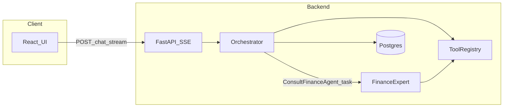

# AI Financial Assistant

Multi-agent, web-search and market-data–aware chat assistant. The repo provides a hybrid local stack (React + FastAPI + PostgreSQL + Redis) and streams answers with **inline source citations** grounded in tool output.

**Technical deep dives (decoupled docs):**

- **Backend and AI engine:** [backend/TECH_SPEC.md](backend/TECH_SPEC.md)
- **Frontend and UI/UX:** [frontend/TECH_SPEC.md](frontend/TECH_SPEC.md)
- **Assignment / coursework baseline:** [DEVELOPMENT_SPEC.md](DEVELOPMENT_SPEC.md) (stack, grading-related requirements, test cases)

---

## Core functional requirements

| ID | Requirement |
| --- | --- |
| **FR-1** | **Multi-agent routing:** An orchestrator decides when to answer directly vs. invoke tools or delegate to a finance-focused sub-agent. |
| **FR-2** | **Source citation:** Responses that use retrieved content must cite sources (e.g. `[1]` and references tied to tool results / URLs). |
| **FR-3** | **Real-time / fresh data:** When the user needs current quotes, news, or macro context, the system uses **Tavily** (search) and/or **yfinance** (market data), not model guesses. |
| **FR-4** | **Tool calling:** OpenAI function calling with a **registry** of allowed tools; orchestrator and finance expert see **different, filtered** tool surfaces. |
| **FR-5** | **Streaming UX:** Final answer text streams over **SSE**; the UI shows a **thought process** line driven by `status` events (see [backend/TECH_SPEC.md](backend/TECH_SPEC.md) § SSE API Contract). |

---

## High-level multi-agent architecture



- **Orchestrator:** Loads session history from **Postgres**, runs a **bounded** tool loop (see Scope below), may call web search / clarify intent / delegate.
- **Finance expert:** Invoked only via delegation; **tight context isolation** — it sees `[system + user task]` only, not full chat history ([backend/TECH_SPEC.md](backend/TECH_SPEC.md)).
- **Persistence:** **PostgreSQL** is the source of truth for sessions and messages; **Redis** is ephemeral (cache, limits, dedupe — see Scope).

---

## Scope definition and V1 trade-offs

### In scope (V1)

- **Bounded agent loops** (`max_orchestrator_rounds`, `max_finance_rounds`); on exceed → terminal **`error`** SSE (see TECH_SPEC).
- **Tight context isolation** for the finance expert: clean `[system, task]` thread; only the final expert text returns to the orchestrator transcript.
- **Postgres for chat history**; **not** Redis for durable messages.
- **Tool registry** with allowlisted names; structured tool results; permission-filtered tool lists per agent role.
- **SSE contract** with `status`, `token`, terminal `done` / `error` (normative shapes in TECH_SPEC files).
- **Graceful cancellation:** client **AbortController**; server **`asyncio.CancelledError`** handling on the stream.
- **Orchestrator-only** history window (`max_context_messages`) when building context from the DB.
- **Anonymous JWT** (HttpOnly cookie), **invite-only uplift**, **daily visitor cap**, **Redis per-session API quotas**, and **IP rate limits** on protected routes; normative detail in [backend/TECH_SPEC.md](backend/TECH_SPEC.md). Invite links: `python scripts/generate_invite.py --client "Name"` (requires `REDIS_URL` and optional `PUBLIC_APP_ORIGIN`).

### Out of scope or deferred (V1)

- **Document compaction / long-thread summarization** pipelines (optional later).
- **Pre/post tool hooks**, **MCP**, **multi-provider** LLM abstraction.
- **Persisting** finance expert internal mini-thread rows by default (optional debug flag later).
- **Idempotency** / duplicate-send dedupe on `POST /api/chat/stream` (optional; see DEVELOPMENT_SPEC §4.B).
- Full **mock-LLM CI matrix**; prefer **targeted** tests with mocked HTTP.

---

## Project Startup & Environment Setup

### 1. Configure environment variables

1. Copy the backend environment template:

   ```bash
   cp backend/.env.example backend/.env
   ```

2. Ensure `backend/.env` contains valid connection strings and auth settings:

   - `DATABASE_URL` (PostgreSQL; local Docker or Neon)
   - `REDIS_URL` (Redis; local or Upstash)
   - `AUTH_JWT_SECRET` (required; sign anonymous session JWTs)
   - Optional cost-control knobs: `MAX_DAILY_VISITORS`, `VISITOR_QUOTA`, `INVITE_QUOTA`, `INVITE_TTL_SECONDS` (invite key TTL in Redis, default one week), `RATE_LIMIT_PER_MIN` (see `.env.example`)

See [backend/TECH_SPEC.md](backend/TECH_SPEC.md) for API keys used by the AI engine (`OPENAI_API_KEY`, `TAVILY_API_KEY`, etc.) and the full anonymous-auth flow.

### 2. Start the local hybrid stack (Docker)

From the repository root:

```bash
docker-compose up --build
```

Or using the Makefile:

```bash
make up
```

Expected ports:

- Frontend (Vite): `http://localhost:5173`
- Backend (FastAPI): `http://localhost:8000`
- RedisInsight UI: `http://localhost:5540`

### 3. Stop the stack

```bash
docker-compose down
```

---

## Architecture Design

### Hybrid deployment

Behavior is driven by **environment variables** (`.env`): **local** = root `docker-compose.yml` (frontend, backend, Postgres, Redis); **production** = frontend (Vercel/Netlify), backend (Render/Railway), Postgres (Neon or equivalent), Redis (Upstash or equivalent). Same codebase; no host hardcoding — use `DATABASE_URL` and `REDIS_URL`.

### PostgreSQL vs Redis

| Store | Role |
| --- | --- |
| **PostgreSQL** | **Source of truth:** `User`, `ChatSession`, `ChatMessage` (and tool metadata columns). Full conversation history for context assembly. |
| **Redis** | **Ephemeral:** Tavily/yfinance response cache (TTL ~300s), rate limits, request dedupe — **not** chat logs. |

Schema and column-level detail: [backend/TECH_SPEC.md](backend/TECH_SPEC.md).

### Migrations

The backend runs `alembic upgrade head` then starts FastAPI. Use the Makefile for local workflow:

```bash
make db-upgrade
make db-migrate MSG="describe_change"
```

---

## Terraform Quick Start (EC2 + Route53)

From repo root:

```bash
cd terraform
terraform init
```

Set required variables from environment (no hardcoded key file path):

```bash
export TF_VAR_public_key_content="ssh-ed25519 AAAA... your_email@example.com"
export TF_VAR_ssh_allowed_cidrs='Your CIDR block'
```

Run:

```bash
terraform plan
terraform apply -auto-approve
```

Destroy when needed:

```bash
terraform destroy
```

---

## AI Tools Usage

This project was bootstrapped with AI-assisted tooling (e.g. Cursor).

Example prompts used for traceability:

- “Generate a root `docker-compose.yml` with frontend, backend, Postgres 15, Redis, and RedisInsight.”
- “Create FastAPI endpoints for `/health` and dummy SSE `POST /api/chat/stream` with correct event framing.”
- “Scaffold a minimal Vite + React + TypeScript UI that consumes SSE.”
- Planning iterations: multi-agent Phase 2 plan, scope-limited runtime adoption, three-tier docs (README + `backend/TECH_SPEC.md` + `frontend/TECH_SPEC.md`).

---

## Developer ergonomics (Makefile)

```bash
make db-upgrade
make db-migrate MSG="add_new_tables"
```

---

## CI/CD (GitHub -> EC2 Docker rebuild)

Pushes to `main` trigger `.github/workflows/deploy-ec2.yml`, which SSHes into EC2, pulls latest code, and runs:

```bash
docker compose down
docker compose up -d --build
```

Configure these GitHub Actions repository secrets:

- `EC2_HOST` - EC2 public IP or DNS
- `EC2_USER` - SSH user (typically `ubuntu`)
- `EC2_SSH_KEY` - private key content for SSH (matching your EC2 key pair)

---

## Engineering standards

See [.cursor/rules/senior-review-and-engineering-standards.mdc](.cursor/rules/senior-review-and-engineering-standards.mdc) and [DEVELOPMENT_SPEC.md](DEVELOPMENT_SPEC.md) for review expectations, testing ideas, and assignment checklist.
